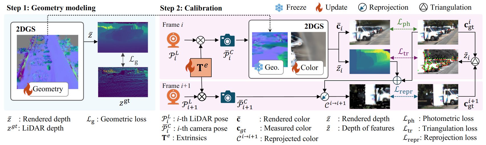

# Robust LiDAR-Camera Calibration with 2D Gaussian Splatting 
[Paper](https://ieeexplore.ieee.org/document/10933576) | [Appendix](assets/appendix.pdf) | [Data](https://www.cvl.iis.u-tokyo.ac.jp/~zhoushuyi495/dataset/robust-k.zip)

This repository is the implementation for "Robust LiDAR-Camera Calibration with 2D Gaussian Splatting", accepted to IEEE Robotics and Automation Letters (Ra-L), 2025.
## Introduction

The right panel illustrates how the LiDAR frames were used to supervise the geometric properties of the 2DGS. As shown in the left panel, we freeze the geometric properties and update only the color properties during the calibration process. In addition to photometric loss, we also employ two interframe losses: triangulation loss and reprojection loss.

## Implementation
For academy use only. Please cite the paper if you use this code.
### Installation
1. Install [PyTorch](https://pytorch.org/get-started/locally/).
    - Our code was tested with GTX4090, Ubuntu 20.04.6 LTS, CUDA 12.4, PyTorch 2.5.1
2. Clone repository and install dependencies
    - The example here is simply using pip
    - Note that you can also use Conda or any other enviroments as long as the Python library can be installed
    ```
    git clone --recursive git@github.com:ShuyiZhou495/RobustCalibration.git
    cd RobustCalibration/submodules/diff-surfel-rasterization.git
    cd ../..
    python3 setup.py install
    pip install -e requirements.txt
    ```
### Data
We provide the KITTI data after motion-compensation in [this url](https://www.cvl.iis.u-tokyo.ac.jp/~zhoushuyi495/dataset/robust-k.zip). The data follows the [Creative Commons Attribution-NonCommercial-ShareAlike 3.0](https://creativecommons.org/licenses/by-nc-sa/3.0/) liscene of [KITTI](https://www.cvlibs.net/datasets/kitti/eval_odometry.php). All copyright are by the authors of KITTI. You must attribute the work in the manner specified by the authors of KITTI, you may not use this work for commercial purposes and if you alter, transform, or build upon this work, you may distribute the resulting work only under the same license.

- To generate your own data: the superpoint and superglue follows https://github.com/Shiaoming/Python-VO. Please output the matched points to superpoint-superglue.npy in your date directory. An example of outputting superpoint-superglue.npy file is in [submodules](./submodules/Python-VO/).

### Run
0. Alter the data path in option.yml.
1. **Step 1**: Use LiDAR to make geometry
    ```bash
    python3 geometry/main.py --save_dir [scene name] 
    ```
    example:
    ```bash
    python3 geometry/main.py --save_dir 5-0-t
    ```

2. **Step 2**: Calibration
    ```bash
    python3 calibration/main.py -g=[scene name]
    ```
    example
    ```bash
    python3 calibration/main.py -g=5-0-t
    ```
    to render color image
    ```bash
    python3 calibration/main.py -g=[scene name] --render
    ```
### License
The license information for related code is provided inline. For more details, please refer to the [licenses](licenses/) folder.
## Citation
```bibtex
@ARTICLE{zhou2025robust,
  author={Zhou, Shuyi and Xie, Shuxiang and Ishikawa, Ryoichi and Oishi, Takeshi},
  journal={IEEE Robotics and Automation Letters}, 
  title={Robust LiDAR-Camera Calibration With 2D Gaussian Splatting}, 
  year={2025},
  volume={10},
  number={5},
  pages={4674-4681},
  doi={10.1109/LRA.2025.3552955}}
```